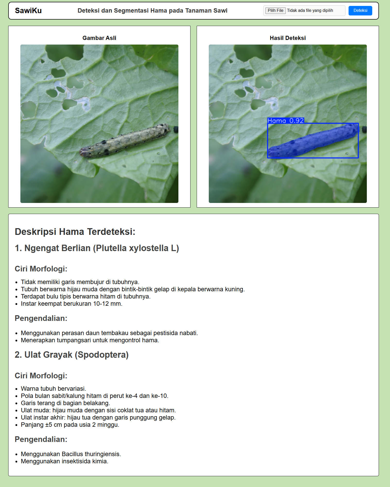

# 🌿 SawiKu - Deteksi & Segmentasi Hama Tanaman Sawi Hijau

Aplikasi web untuk mendeteksi dan mensegmentasi hama pada tanaman sawi hijau 
menggunakan model YOLOv8, dibangun dengan Flask dan dapat diakses online via ngrok.

## 📸 Demo Aplikasi


## ✨ Fitur
- Upload gambar tanaman sawi untuk dianalisis
- Deteksi dan segmentasi hama secara otomatis
- Menampilkan confidence score hasil deteksi
- Deskripsi lengkap hama yang terdeteksi beserta ciri morfologi
- Rekomendasi cara pengendalian hama
- Dapat diakses online via ngrok

## 🛠️ Tech Stack
- **Model:** YOLOv8 (training di Kaggle)
- **Backend:** Python, Flask
- **Frontend:** HTML, CSS
- **Deployment:** ngrok

## 🐛 Hama yang Dapat Dideteksi
- Ngengat Berlian (*Plutella xylostella* L.)
- Ulat Grayak (*Spodoptera* sp.)

## 🚀 Cara Menjalankan

### 1. Clone repository
```bash
git clone https://github.com/voiddoiv/sawiku-segmentation.git
cd sawiku-segmentation
```

### 2. Install dependencies
```bash
pip install -r requirements.txt
```

### 3. Jalankan aplikasi
```bash
python app.py
```

### 4. Akses local di browser 
```
link yang diberikan flask
```

## 📊 Model Training
Model dilatih menggunakan dataset tanaman sawi hijau di Kaggle.
🔗 [https://www.kaggle.com/code/gerenhh/deteksi-hama-caisim-segmentasi](#)

## 👤 Developer
**Geren HH** - [GitHub](https://github.com/voiddoiv)